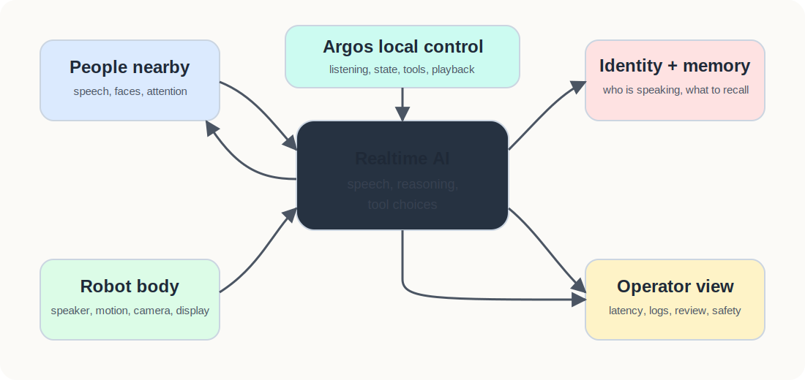
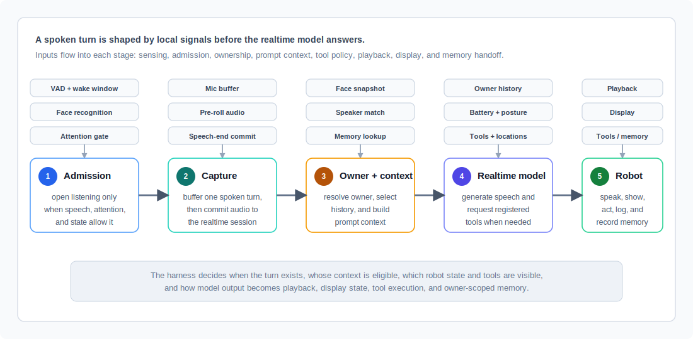

# Argos Realtime Robot Companion VBR

July 2026

## 1. Context

Argos is the software layer that turns a Unitree Go2 robot into a voice-first, context-aware companion. The easiest way to understand it is this: Argos sits between people, an AI voice model, the robot body, and the surrounding identity and memory systems. It decides when the robot should listen, what the robot should know about the current moment, what physical actions are allowed, and how the interaction should be remembered.

This matters because a robot conversation is harder than a normal chatbot conversation. A chatbot can wait for typed input. A robot has to decide whether someone is actually talking to it, whether that person is known, whether another person is nearby, whether it is safe to move, whether it is already speaking, and whether the answer should appear on a screen, through voice, through a gesture, or through a tool action. Argos is the control layer that makes those decisions around the realtime AI model.

The goal for this review is to explain what Argos can do today, why the architecture is promising, and what needs to be proven next. The current system is best described as an integrated demo path with strong architecture coverage. The next step is to turn that demo path into measured reliability: repeatable perception results, clearer ownership boundaries, stronger latency evidence, and a runtime that is easier to maintain.

Figure 1. Argos connects human interaction, realtime AI, robot behavior, identity, memory, and operator visibility.

{width=6.8 height=3.25}

## 2. What Argos Can Do

Argos is not just "voice on a robot." It combines conversation, perception, memory, embodiment, and tools into one interaction loop.

| Capability | What it means in plain language | Why it matters |
|---|---|---|
| Natural voice interaction | A person can speak to the robot and hear a spoken response from the AI model. | The robot feels conversational instead of menu-driven. |
| Local listening control | The robot uses wake word, voice activity, attention, and interaction state before it records a turn. | The robot is less likely to respond to random background speech. |
| Face awareness | The robot tracks whether people are visible and whether someone appears oriented toward it. | Presence can shape greetings, listening, and social context. |
| Speaker ownership | Completed speech can be compared against saved voice references and combined with face evidence. | The robot can decide whose conversation and memories are in scope. |
| Person memory, when enabled | Owner-scoped context can be pulled from the memory system and new recognized conversations can be recorded. | The robot can remember preferences and follow-ups without mixing people together. |
| Robot actions and tools | The AI model can call approved local tools for posture, movement, gestures, camera capture, identity enrollment, and memory search. | The model can act through the robot, but only through bounded interfaces. |
| Interaction display | A screen can show face state, subtitles, thinking/recording state, and enrollment review. | People can understand what the robot is doing and approve sensitive captures. |
| Observability | The runtime records timing and usage markers around listening, model response, playback, tools, and memory queries. | Operators can debug whether the robot is slow, blocked, or using the wrong context. |

## 3. How A Conversation Turn Works

The most important design choice is that Argos does not let the model decide everything on its own. The AI model is central, but Argos owns the robot-facing control loop.

Before the model responds, Argos has already made several decisions. It checks whether listening should open, captures only the intended speech turn, commits that turn into the realtime session, resolves the likely speaker, builds the current context, and only then asks the model to answer. After the model responds, Argos owns playback, display updates, tool execution, and memory recording.

Figure 2. A human turn moves through local robot control before the AI response is triggered.

{width=6.8 height=2.2}

This is the main reason the architecture is credible. The realtime model gives Argos natural speech and reasoning, but the robot still has deterministic guardrails around listening, identity, action, and state. In practical terms, this means the system can say, "I should not listen yet," "I know who is speaking," "I need to keep this person's memory separate," or "this action is not allowed right now" before the AI response becomes physical behavior.

## 4. Identity, Memory, And Trust

The trust problem for Argos is not simply whether the robot recognizes someone. The harder problem is whether it attributes the conversation to the right person. A wrong answer can be corrected. A wrong memory attached to the wrong person is much more damaging.

Argos separates the identity problem into four parts:

| Layer | What it owns | Trust boundary |
|---|---|---|
| Face identity | Visual recognition from the camera, with quality and depth checks. | A face alone is not enough to decide who spoke. |
| Speaker identity | Voice matching from the completed spoken turn. | Voice evidence must be strong enough or the owner remains uncertain. |
| Person record | Name, aliases, and employee-style metadata for the person. | Identity data stays separate from social memory. |
| Social memory | Preferences, notes, follow-ups, and conversation episodes when memory is enabled. | Memory is scoped to the resolved speaker, not just whoever is visible. |

That separation is important. If one person is visible but another speaks off-camera, the system should not blindly attach the conversation to the visible person. If two faces are visible, the system should avoid pretending the scene is simple. If voice evidence is weak, it is better to mark ownership as unknown than to save the wrong memory.

Enrollment follows the same trust logic. The robot can enroll a visible person, but the capture path is quality-gated, and the display can require an accept/reject review before saving a face reference. That makes enrollment feel less like a hidden background process and more like an explicit human-facing workflow.

## 5. Readiness And Evidence

The current Argos architecture is broad enough to show the full product direction: realtime speech, attention-aware listening, face and voice identity, owner-scoped memory, display feedback, robot actions, provider-backed tools, and latency logging. The important next question is not "can another feature be added?" It is "which parts are reliable enough to trust repeatedly?"

Table 1. The next VBR should move these areas from described behavior to measured evidence.

| Area | What should be proven next | What good evidence looks like |
|---|---|---|
| Turn reliability | The robot consistently opens, commits, responds, and finishes voice turns without blocking. | Latency summaries across repeated interactions, including time to first audio response. |
| Attention and face handling | The robot listens when someone is plausibly addressing it and ignores nearby side conversations. | Face and attention evaluation across distances, lighting, and multi-person scenes. |
| Owner resolution | The system correctly chooses the speaker or safely stays unknown. | A face-plus-voice evaluation set with correct, rejected, and ambiguous cases. |
| Memory safety | Person context and new memory stay attached to the resolved owner when memory is enabled. | Prompt/context snapshots and memory episode checks from repeated interactions. |
| Tool and motion safety | Model-requested actions stay within approved robot capabilities. | Approved-action checks plus manual robot safety checks for live motion. |
| Operator experience | People can tell when the robot is listening, thinking, speaking, or asking for enrollment approval. | Display screenshots or recordings from representative interactions. |

## 6. Roadmap And Decisions

The next stage should focus on maturity rather than breadth. Argos already touches many of the pieces required for a believable robot companion. The highest-leverage work is to make the existing loop easier to measure, explain, and operate.

1. Build a compact reliability package.
Measure face recognition, speaker recognition, attention gating, owner resolution, turn latency, memory attribution, and display/enrollment behavior on representative interactions.

2. Clarify the orchestration boundary.
Argos is strongest as the social, voice, identity, and embodied-interaction layer. A separate robotics orchestration system may eventually own missions, task state, multi-robot coordination, and warehouse-style execution. The boundary should be explicit before the stack grows.

3. Simplify the runtime.
The current runtime coordinates audio, websocket events, playback, display updates, tools, identity, memory, event coalescing, and robot state. That is a lot of responsibility in one loop. Refactoring the turn lifecycle into smaller, testable pieces will make future changes safer.

4. Keep the evidence standard honest.
The right story is not that Argos is production-ready today. The right story is that the integrated loop is alive, the architecture has the right control boundaries, and the next milestone is to prove reliability with repeatable evidence.

## 7. Key Risks

Perception can be confident and still wrong. Face recognition, head pose, and speaker matching depend on lighting, camera angle, audio quality, distance, and scene complexity. The mitigation is conservative ownership policy and evaluation on real collected interactions.

Memory mistakes can damage trust. A robot that remembers the wrong thing about the wrong person will feel unsafe. The mitigation is owner-scoped memory, explicit uncertainty, and checks that memory is only written when the speaker is resolved.

The robot body raises the stakes. A wrong chatbot answer is annoying; a wrong robot action can be unsafe or disruptive. The mitigation is a bounded action list, capability checks, and operator approval for live motion testing.

Demo polish can hide reliability gaps. A strong demo can still depend on favorable lighting, clean audio, or manual setup. The mitigation is to report measured results separately from demo behavior and make repeatability the next review standard.
