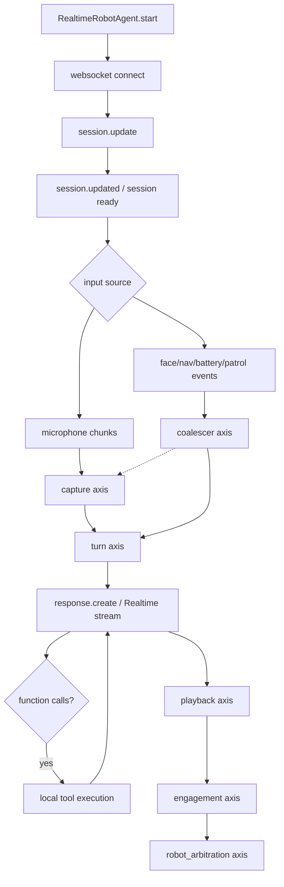
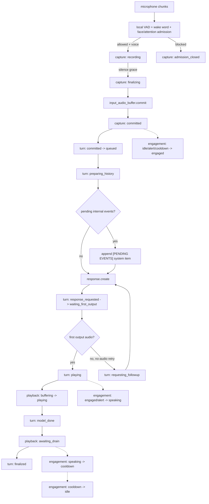
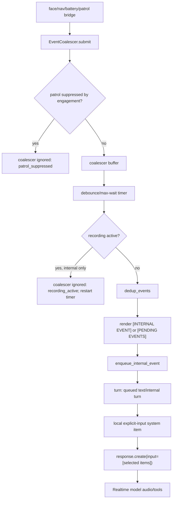
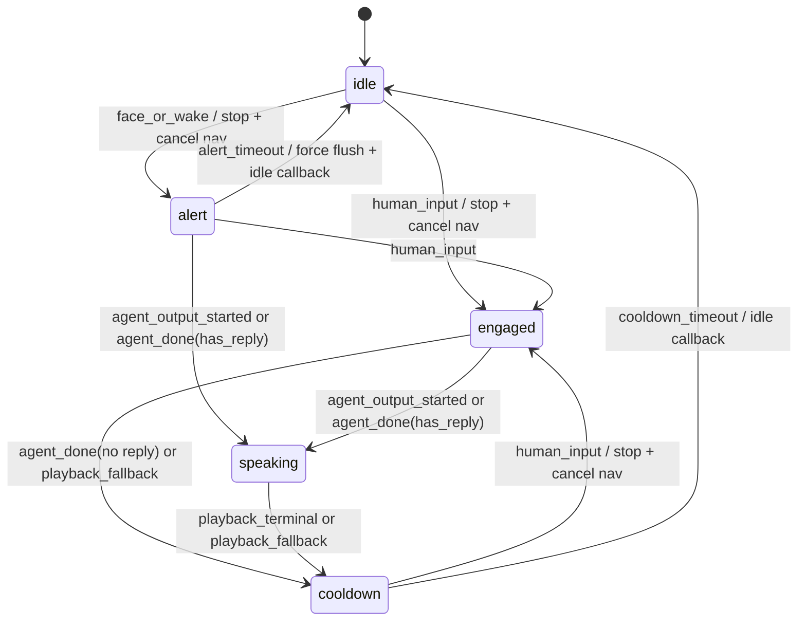
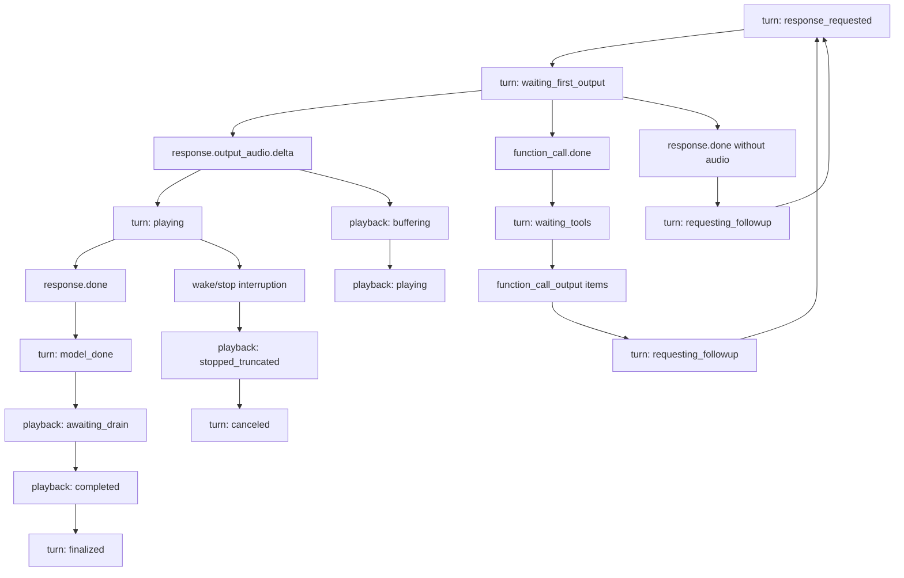

# Realtime State Machine Diagram

This is a visual companion to `realtime_state_model.md` and
`realtime_turn_flow.md`. It is intentionally Mermaid-first so the diagram can be
reviewed, patched, and diffed alongside code changes.

## Why Argos Uses State Axes

Argos is not one monolithic finite-state machine. It runs one persistent
Realtime session while local controllers track several mostly independent
state axes:

- `session`: websocket readiness and shutdown.
- `capture`: local mic admission, VAD, recording, and audio commit.
- `transcription`: committed-audio transcription side channel.
- `turn`: model response lifecycle for one audio or text turn.
- `playback`: local audio buffering, output, drain, and truncation.
- `engagement`: social interaction mode for patrol suppression and passive
  listening.
- `robot_arbitration`: navigation, patrol, battery, owner-turn, and motion
  policy.
- `coalescer`: robot/internal-event batching and deduplication.

This structure keeps the runtime honest. A user can be in `engagement=speaking`
while `turn=model_done` and `playback=awaiting_drain`; forcing that into one
giant enum would either lose information or create an explosion of combined
states.

Primary source files:

- `argos_src/agent/control/types.py` defines the stable axis and state names.
- `argos_src/agent/control/reducers/engagement.py` defines pure engagement
  transition decisions and declarative actions.
- `argos_src/agent/control/reducers/coalescing.py` defines pure internal-event
  dedup/render rules.
- `argos_src/agent/control/engagement_runtime.py`,
  `audio_runtime.py`, `state_runtime.py`, `server_event_runtime.py`,
  `playback_runtime.py`, `event_adapter.py`, and `robot_arbitration.py` apply
  transitions, side effects, and structured logs.
- `argos_src/observability/state_observer.py` writes `component=state`
  transition and ignored-event rows.

One nuance: `coalescer` is an observable state axis for transition/ignored
events, but it is not currently a rich enum like `CaptureState`, `TurnState`,
or `PlaybackState`.

## Runtime Map



## Human Audio Turn



## Internal Robot Event Turn



## Engagement Reducer



The reducer returns a decision: old state, new state, reason, and declarative
actions. The runtime wrapper performs the actions, such as publishing a local
`stop` voice command, canceling interruptible navigation, force-flushing the
coalescer, or notifying patrol-resume logic after idle entry.

## Turn And Playback Branches



## Observability

Each state move should emit:

```text
component=state event=transition axis=<axis> old_state=<old> new_state=<new>
trigger=<trigger> req_id=<req_id> stream_id=<stream_id>
```

Ignored events should emit:

```text
component=state event=ignored axis=<axis> trigger=<trigger>
ignored_reason=<reason>
```

That is why state names are treated as dashboard-stable API. Tests such as
`tests/argos_src/agent/control/test_state_axes.py`,
`test_engagement_reducer.py`, and `test_coalescing_reducer.py` protect this
shape.

## Keeping This Diagram Fresh

Update this file when a change alters any of these:

- A value in `StateAxis`, `CaptureState`, `TurnState`, `PlaybackState`,
  `EngagementMode`, `TranscriptionState`, or `RobotArbitrationState`.
- A reducer transition, reducer action, or coalescing rule.
- The order of audio commit, response creation, server-event binding, playback
  completion, tool follow-up, interruption, or watchdog recovery.
- The structured state observer contract consumed by logs or dashboards.

Suggested subagent prompt:

```text
Use the state-machine-diagrammer custom agent.

Scope:
- Check the current diff plus docs/realtime_state_machine_diagram.md.
- Read docs/realtime_state_model.md and docs/realtime_turn_flow.md.
- Read touched files under argos_src/agent/control/ and argos_src/runtime/
  that affect state axes, reducers, turn flow, playback, coalescing, or
  robot arbitration.

Task:
- Patch docs/realtime_state_machine_diagram.md if the diagram or source file
  references drift.
- Preserve public state names unless the main task explicitly changed them.
- Report changed paths, evidence checked, and any remaining uncertainty.
```
